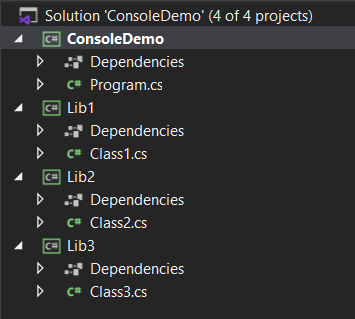
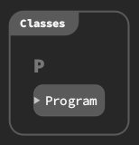
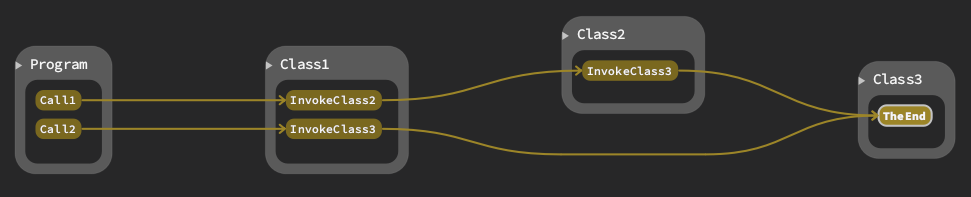

What
----
**SourcetrailDotnetIndexer** is a command-line tool that takes a .NET assembly as input and generates a database that can be loaded with [Sourcetrail](https://www.sourcetrail.com/).  
It uses reflection to collect all types from the assembly and also parses the IL-Code of methods.

It uses [SourcetrailDB](https://github.com/CoatiSoftware/SourcetrailDB) for writing the database.  
For convenience, the native DLL for *SourcetrailDB* is already included, so you don't have to build it yourself.  
Note, the native DLL is a x64 DLL so in your project settings, you have to specify x64 as the target platform as well.

There are actually two variants of the same tool:  
`SourcetrailDotnetIndexer` for the "classic" .NET Framework (2.x to 4.x)  
`SourcetrailDotnetCoreIndexer` for the "new" .net core and .net5+

Why
---
This project arose from an attempt to visualize the class-relationships for a large legacy .NET Application.  
After previous attempts with [Graphviz](https://graphviz.org/) and similar free tools (like [Gephi](https://gephi.org/) and [yEd](https://www.yworks.com/products/yed)) failed
(albeit powerful in their domain, the results were not what i had in mind), i found *Sourcetrail* and it was exactly what i needed.

Disclaimer
----------
This tool **does not** parse source-code, it just takes a compiled assembly.  
This means, there will be no source-code integration available in *Sourcetrail*.  
On the other hand, this means it **should** work with all kinds of .NET assemblies, 
regardless of the language they are created from (e.g. C#, VB.NET, ...)
but i tested in only with a handful of assemblies generated from C#.  
Feel free to open a pull-request if you encounter any flaws.

In version 0.2.0, support for reading *some* source-code information has been added.  
*SourcetrailDotnetIndexer* attempts to read information from PDB-files if they were found next to the assembly.
(e.g. if the path to your assembly is `c:\temp\myApp.exe` *SourcetrailDotnetIndexer* attempts to load the PDB `c:\temp\myApp.pdb`)  
This enables the tool to read the source-formation about where a type or a method is referenced in a method.  
(See the second screenshot below)  
If you need more control over where to locate the PDB-files, please open an issue (or better yet: open a pull-request ! :) and describe your scenario.

Building
--------
Open the `.sln` in VisualStudio and build.

Usage
-----
The following command-line arguments are supported:

* -i `assembly-path`   
  specifies the path to the input-assembly, from which the sourcetrail-database is generated.
* -s `search-path`  
  path to load referenced assemblies from   
  this option may be specified multiple times.  
  e.g `-s C:\Windows\Microsoft.NET\Framework64\v4.0.30319`
* -f `name-filter`  
  a string (in regex-format) to specify namespaces, that should be ignored when generating the database.   
  this option may be specified multiple times.   
  e.g. `-f ^System -f ^Microsoft`
* -fn `name-filter`  
  See the paragraph [Building a multi-assembly database](#Building-a-multi-assembly-database) below for details.
* -ff `file-name`  
  See the paragraph [Building a multi-assembly database](#Building-a-multi-assembly-database) below for details.
* -o `output-path`  
  specifies the path, where the database is written to.  
  the output filename is always the name of the assembly with the extension `.srctrldb`.  
  note that *SourcetrailDB* automatically creates a file with the `.srctrlprj` extension in the same folder,
  this is the file you load in *Sourcetrail*.
* -of `output-filename`  
  full path and filename of the generated database  
  If both `-o` and `-of` are specified, `-of` takes precedence.
* -w  
  if specified, waits for the user to press enter before exiting.  
  intended when running from inside VS to keep the console-window open.

**Note**  
If you encounter exceptions when running the tool stating `Unable to load DLL 'SourcetrailDB'`,
your system may be missing the Visual C++ Runtime required by the native *SourcetrailDB* dll.  
In that case, install the runtime for Visual Studio 2019 from [this link](https://support.microsoft.com/en-us/help/2977003/the-latest-supported-visual-c-downloads).  
(make sure to install the x64 version)

#### Building a multi-assembly database
It is a rare case that you have a single executable/dll for your application.  
Most of the time, you have additional libraries that are used (e.g. *referenced*) by your application.  
Since v0.2.4 *SourcetrailDotnetIndexer* is able to follow these references and include them in the generated database as well.  
To accomplish this, two new command-line switches were introduced:
* `-fn name-filter`  
    Specifies a string that is treated as a regex that matches one or more namespace-names.  
    If *SourcetrailDotnetIndexer* encounters a type from a different assembly than the one specified with the `-i` switch,
    it checks whether the namespace of this type matches one of the specified regex-patterns.  
    If the name matches, the type is included in the generated database.
* `-ff file-name`  
  This is a convenience-option.  
  Instead of having to specify multiple namespaces with the `-fn` switch,
  you can specify a single file that contains all the namespace-names which make up your application.

Consider this fairly simple VisualStudio solution:  
  
It contains a .net5 console application and 3 class libraries (in netstandard 2.0 format)  
The namespaces of these projects match their project-name (e.g. classes in Lib2 have the namespace "Lib2").  
If you would index the ConsoleDemo project, you would just see a single class in Sourcetrail:  
  
To index the assemblies referenced by *ConsoleDemo* as well, we utilize the `-fn` switch.  
The command line would look something like this:  
`SourcetrailDotnetCoreIndexer.exe -i ConsoleDemo.dll -o . -f ^System -fn ^Lib\d`  
Note the `-fn` switch, here we utilize the fact that the namespaces have a common format (Lib1 to Lib3) so we use the regex-pattern `\d` that matches a single digit (a character in the rage '0' to '9').  
As an alternative, we could have specified the namespaces explicitly to generate the same output:  
`-fn ^Lib1 -fn ^Lib2 -fn ^Lib3`

Note: If the same pattern is specified for the `-f` AND the `-fn` switch, the `-f` switch takes precedence.

If your application references more than a handful of assemblies and the namespaces of the referenced assemblies do not share a pattern that could simply be translated into a regex-pattern,
it may be more convenient to put all these namespace-names into a single file and reference just that file when running the indexer.  
That is the purpose of the `-ff` switch.  
Sticking with the former example, we create a text-file with the following content:
````
# this is a comment
^Lib1
^Lib2
^Lib3
````
The file contains all the namespaces, we want to include (one per line).  
When reading the file, SourcetrailDotnetIndexer skips empty lines and lines starting with a '#'-character,
so you could even put comments into the file.  
We save this file as *refAssemblies.txt* and specify it as an argument for the `-ff` switch:  
`SourcetrailDotnetCoreIndexer.exe -i ConsoleDemo.dll -o . -f ^System -ff refAssemblies.txt`

Opening the generated database in Sourcetrail now also shows classes from the referenced assemblies:  
  
And displaying the caller-graph for the single method in *Lib3* shows a trail trough all our assemblies:  


Results
-------
This is an image taken from sourcetrail after creating the database for **SourcetrailDotnetIndexer** itself.


This is a screenshot with source-information read from a PDB.
